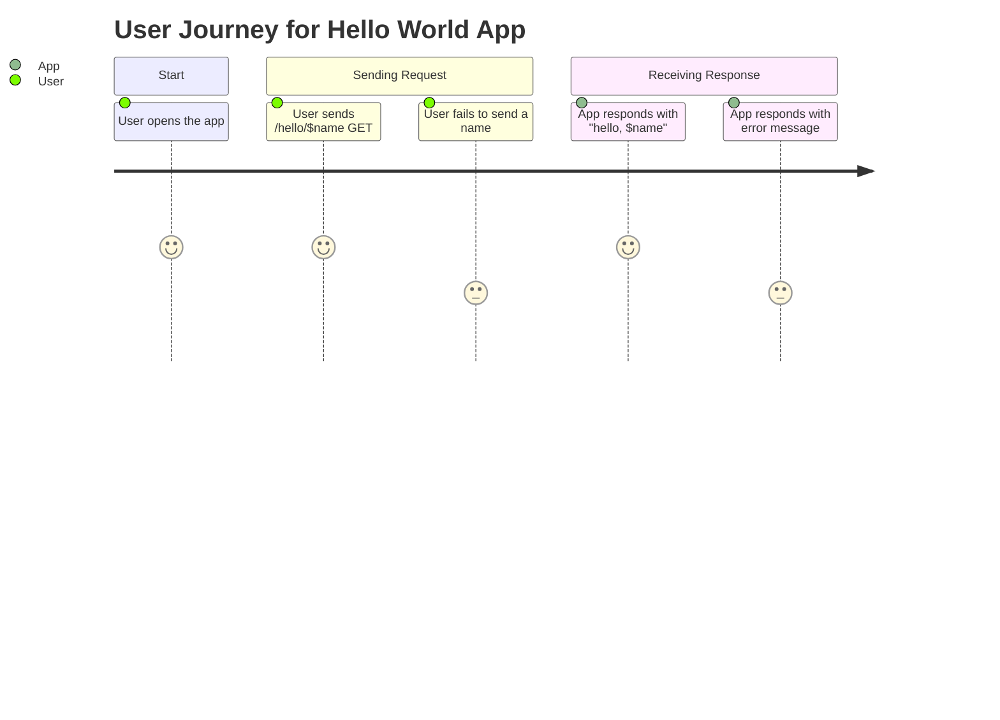
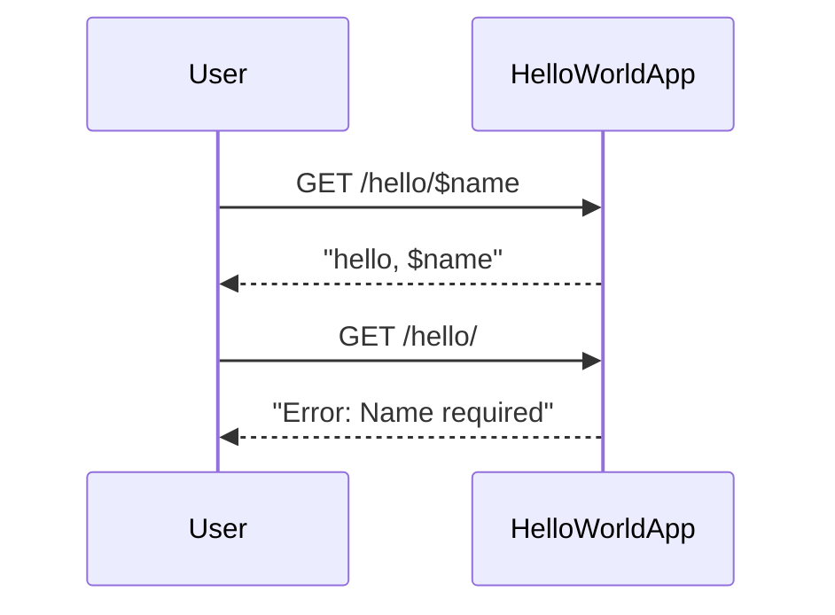
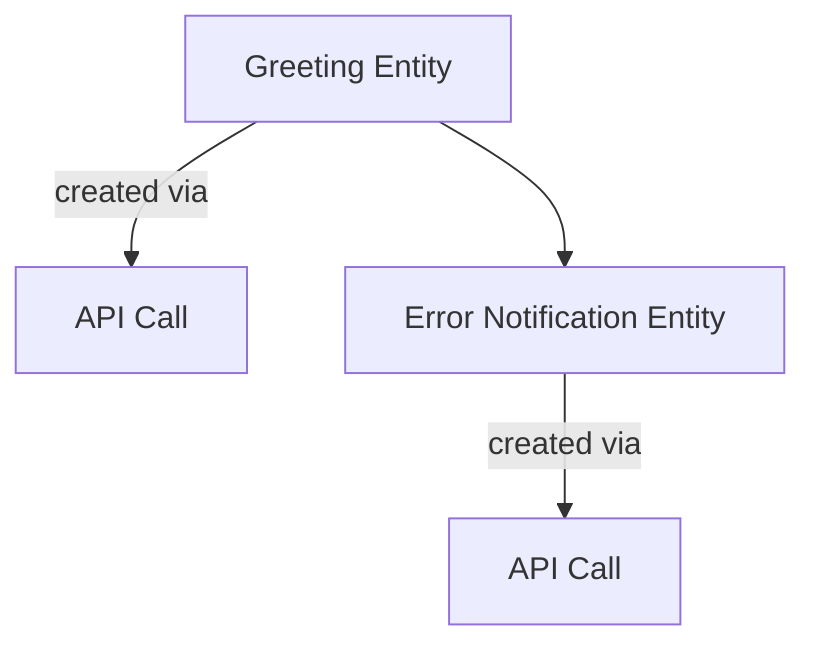
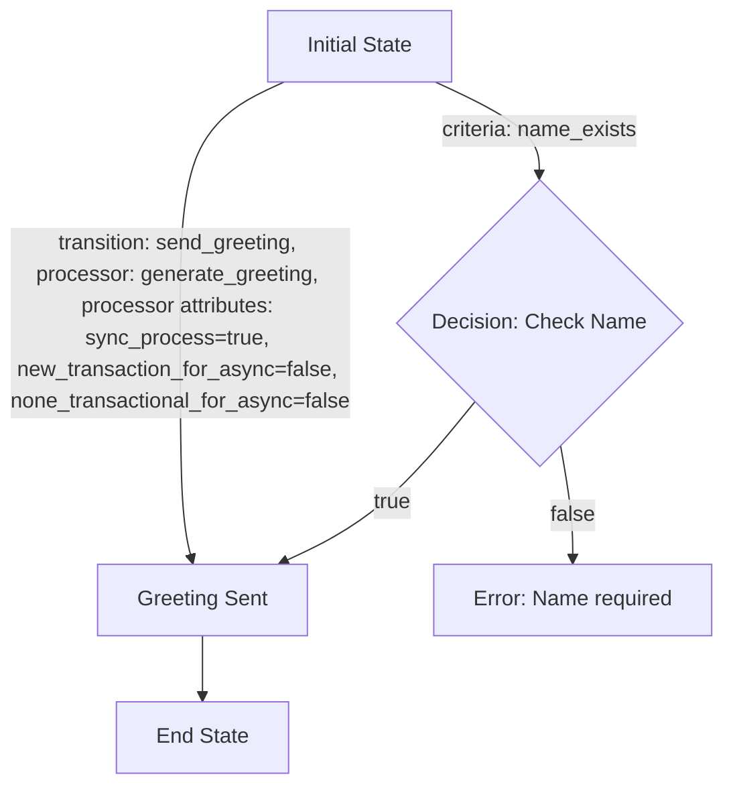

Absolutely! Here’s a complete Product Requirements Document (PRD) for your "Hello World" app. 

---

# Product Requirements Document (PRD) for "Hello World" App

## Introduction

This document outlines the requirements for a simple "Hello World" app where users can send a GET request with their name and receive a personalized greeting. The app serves as a foundational example of how to handle requests and responses in a web application.

## Objectives

- Allow users to send their name via a GET request.
- Return a personalized greeting or an error message if the name is missing.

## User Requirements

### User Stories

1. **As a user**, I want to send a GET request with my name so that I can receive a personalized greeting.
2. **As a user**, I want to receive an error message if I forget to include my name in the request, so I know what to do next.

### Journey Diagram



### Sequence Diagram



## Entities

### Entities Overview

1. **Greeting Entity**
   - **Description**: Stores the greeting message.
   - **Data Model**:
     ```json
     {
       "id": "12345",
       "name": "John",
       "message": "hello, John"
     }
     ```
   - **Save Method**: Stored directly via an API call.

2. **Error Notification Entity**
   - **Description**: Captures error messages related to missing names.
   - **Data Model**:
     ```json
     {
       "id": "67890",
       "error_message": "Error: Name required"
     }
     ```
   - **Save Method**: Created directly when the user fails to provide a name.

### Entities Diagram



### Greeting Entity Workflow



## Conclusion

The "Hello World" app is designed to provide a simple but practical example of handling requests in a web application. By implementing the outlined entities and workflows, the app will efficiently process user requests and provide meaningful responses. This PRD serves as a foundation for development and implementation of the application.

---

Let me know if you need any changes or additional details! 😊