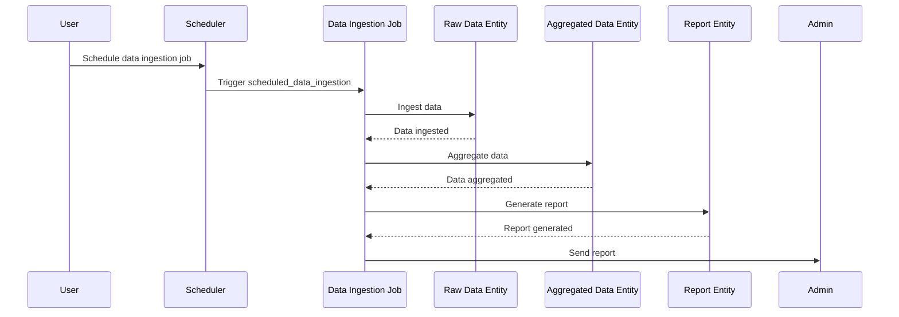

# Product Requirements Document (PRD) for Cyoda Design

## Introduction

This document outlines the design of a Cyoda-based application aimed at ingesting data from specified sources, aggregating that data, saving it to a report, and sending the report to an admin's email. This overview will explain the structure of the Cyoda design JSON, the role of entities within the Cyoda ecosystem, and how the event-driven architecture aligns with the requirements.

## What is Cyoda?

Cyoda is a serverless, event-driven framework that allows you to manage workflows efficiently through entities, which can represent both jobs and data. Each entity holds a defined state and can transition between states based on events—actions that happen in the system, like data ingestion or report generation.

## Cyoda Entity Database

In Cyoda, entities are the fundamental building blocks that represent both the processes (jobs) and the data (raw, aggregated, reports) that your application handles. Each entity has several properties:

- **Entity Name**: The identifier for the entity.
- **Entity Type**: The category of the entity (e.g., JOB, DATA).
- **Entity Source**: The origin of the entity, such as API requests, scheduled events, or other entity events.
- **Depends on Entity**: Relationships between entities, indicating their dependencies.
- **Entity Workflow**: Defines the process that governs the entity's state transitions.

### Entities in Our Design

Based on the requirement, the following entities were defined in the Cyoda design:

1. **Data Ingestion Job (`data_ingestion_job`)**: 
   - Type: JOB
   - Source: SCHEDULED
   - This job is scheduled to ingest data from a specified data source once a day.

2. **Raw Data Entity (`raw_data_entity`)**: 
   - Type: EXTERNAL_SOURCES_PULL_BASED_RAW_DATA
   - Source: ENTITY_EVENT
   - This entity stores the raw data that has been ingested.

3. **Aggregated Data Entity (`aggregated_data_entity`)**: 
   - Type: SECONDARY_DATA
   - Source: ENTITY_EVENT
   - This entity stores the aggregated data derived from the raw data.

4. **Report Entity (`report_entity`)**: 
   - Type: SECONDARY_DATA
   - Source: ENTITY_EVENT
   - This entity holds the generated report that will be sent to the admin.

### Workflow Overview

The Cyoda design JSON outlines workflows tied to each job entity, consisting of transitions. Transitions define how an entity moves from one state to another based on events that occur. The `data_ingestion_job` has several transitions:

- **Scheduled Data Ingestion**: Initiates the data ingestion process.
- **Aggregate Data**: Aggregates the ingested raw data.
- **Generate and Send Report**: Creates a report from the aggregated data and sends it to the admin.

### Event-Driven Approach

An event-driven architecture enables the application to react to changes or triggers automatically. Each time an action occurs (like completing data ingestion), an event is emitted that can initiate subsequent actions (like aggregating data or sending reports). This promotes scalability and responsiveness.

#### Sequence Diagram

### Actors Involved

- **User**: Initiates the scheduling of the data ingestion job.
- **Scheduler**: Triggers the job at specified times.
- **Data Ingestion Job**: Manages the entire data processing workflow.
- **Raw Data Entity**: Stores the data that gets ingested.
- **Aggregated Data Entity**: Holds the data after aggregation.
- **Report Entity**: Contains the generated report.
- **Admin**: Receives the report via email.

## Conclusion

The Cyoda design effectively aligns with the requirement to create a robust workflow for ingesting, aggregating, and reporting data. By leveraging the event-driven model, the application becomes responsive and efficiently manages the state transitions of each entity involved. The outlined entities and workflows comprehensively cover the needs of the application, ensuring a smooth process from data ingestion to report delivery. 

This PRD serves as a foundation for further implementation and development phases, guiding the technical team through the specifics of the Cyoda architecture.