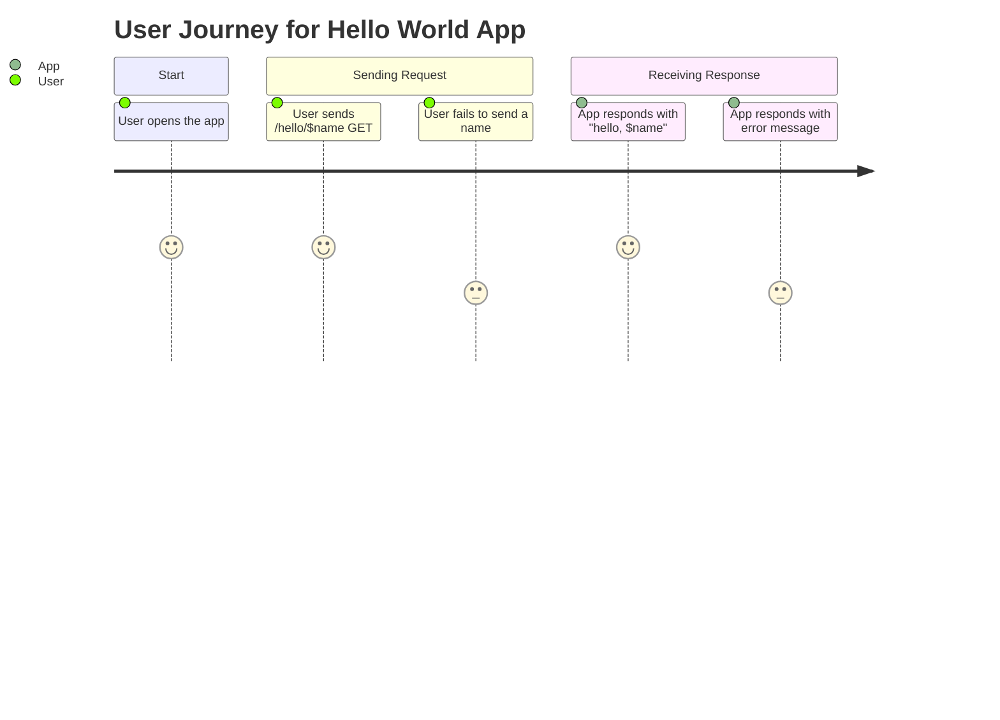
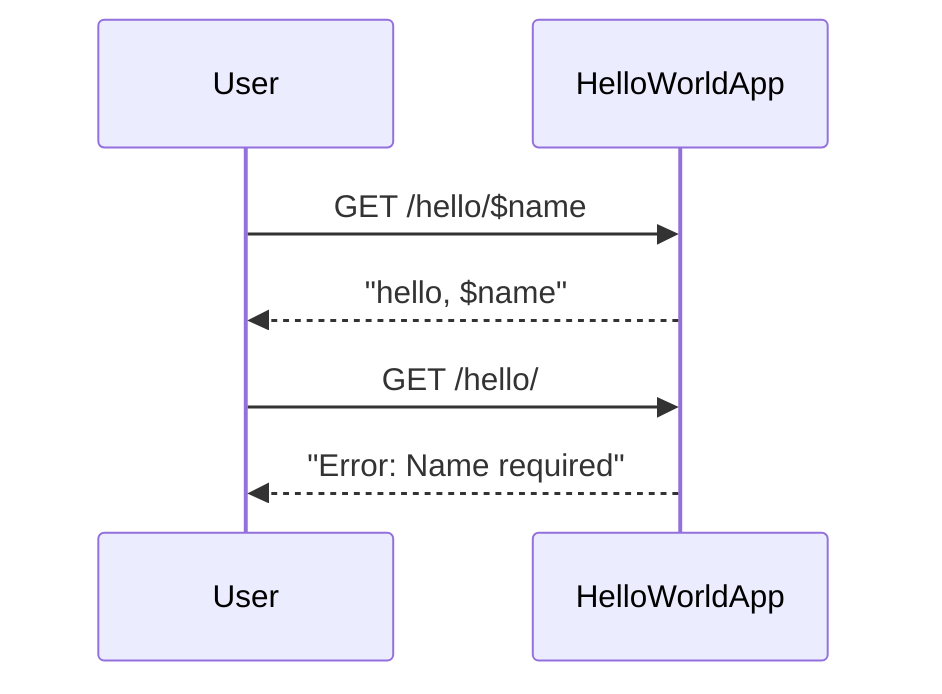

Got it! You want me to validate your requirement for the "Hello World" app and return a user requirement document that includes user stories, a journey diagram, and a sequence diagram. Sounds great!

### User Requirement Document

#### User Stories

1. **As a user**, I want to send a GET request with my name so that I can receive a personalized greeting.
2. **As a user**, I want to receive an error message if I forget to include my name in the request, so I know what to do next.

#### Journey Diagram

#### Sequence Diagram

### Explanation

- **User Stories**: I included these to capture what the user wants to achieve in a simple, relatable way. It keeps the focus on the end-user experience!
  
- **Journey Diagram**: This diagram shows the different steps a user goes through while interacting with the app. It highlights the happy path (sending the name and getting a greeting) and the error scenario, giving a clear view of the user experience.

- **Sequence Diagram**: This diagram illustrates the interaction between the user and the app. It shows how the GET request is handled and what responses are sent back, making it easy to understand the flow.

Feel free to let me know if you want to add or change anything! 😊