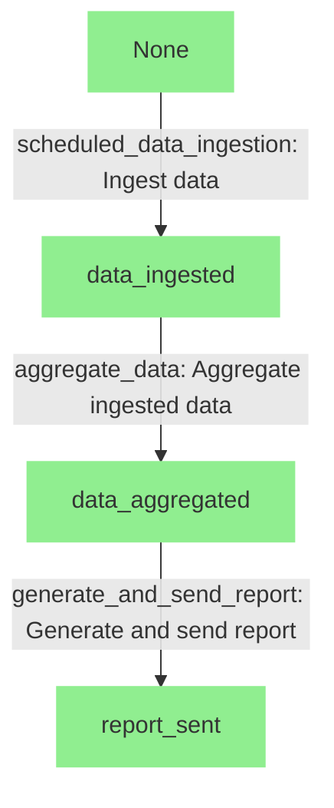

```mermaid
flowchart TD
    A[None] -->|scheduled_data_ingestion: Ingest data| B[data_ingested]
    B -->|aggregate_data: Aggregate ingested data| C[data_aggregated]
    C -->|generate_and_send_report: Generate and send report| D[report_sent]

    class A,B,C,D automated;

    classDef automated fill:#90ee90,stroke:#90ee90;
```
