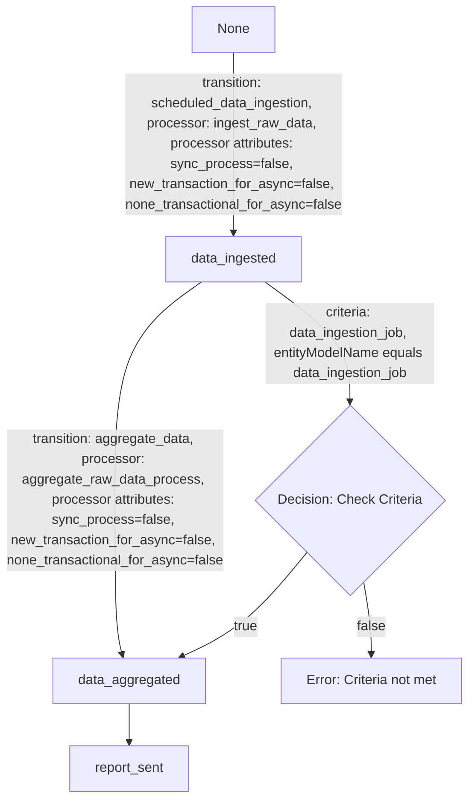

```mermaid
flowchart TD
    A[None] -->|transition: scheduled_data_ingestion, processor: ingest_raw_data, processor attributes: sync_process=false, new_transaction_for_async=false, none_transactional_for_async=false| B[data_ingested]
    B -->|transition: aggregate_data, processor: aggregate_raw_data_process, processor attributes: sync_process=false, new_transaction_for_async=false, none_transactional_for_async=false| C[data_aggregated]
    C --> D[report_sent]
    
    %% Decision point for the criteria
    B -->|criteria: data_ingestion_job, entityModelName equals data_ingestion_job| D1{Decision: Check Criteria}
    D1 -->|true| C
    D1 -->|false| E[Error: Criteria not met]
    
    class A,B,C,D,D1 automated;

```
